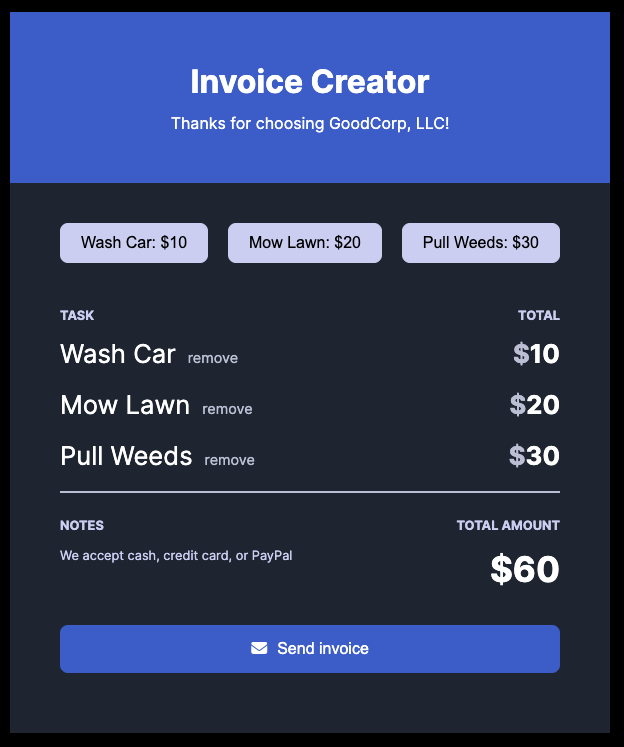

## Overview

### The challenge

This was a Scrimba solo project using HTML, CSS and JavaScript to create an Invoice Creator for a fictional client. It displays the task and costs. When clicking on the task it gets added to the tasklist. The total amount updates as tasks are added to the list.

### The requirements

- Array to hold requested tasks
- Buttons to add a task to array
- Display data from array; should update when the array changes
- Charge only once for each task
- Update total amount each time a task gets added
- Button to "send invoice" (reset)

### Screenshot

## My process

- Create Github repository
- Consult Figma design files
- Work on HTML, CSS and JavaScript files
- Check final code and accessibility
- Finalize README file
- Publish live URL

## Author

- LinkedIn - [LinkedIn](https://www.linkedin.com/in/christina-ligare/)
